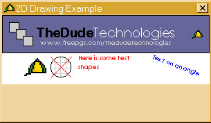



## Drawing 2d Graphics

### Description

!Updated yet again. (5/6/04 (June)).

These classes take all the hard work out of the Win API. Classes include:

clsDraw - Draws text and 2D geometry. Also does collision detection. Ie. Lines, Rectangles, Ellipses.

clsBMP - creates/Loads bitmaps and can create masks at runtime.

!Now includes an example.
 
### More Info
 

             |
---                |---
**Submitted On**   |2004-06-05 10:17:16
**By**             |[James Newell](https://github.com/Planet-Source-Code/PSCIndex/blob/master/ByAuthor/james-newell.md)
**Level**          |Beginner
**User Rating**    |5.0 (25 globes from 5 users)
**Compatibility**  |VB 5\.0, VB 6\.0
**Category**       |[Graphics](https://github.com/Planet-Source-Code/PSCIndex/blob/master/ByCategory/graphics__1-46.md)
**World**          |[Visual Basic](https://github.com/Planet-Source-Code/PSCIndex/blob/master/ByWorld/visual-basic.md)
**Archive File**   |[Drawing\_2d175508682004\.zip](https://github.com/Planet-Source-Code/james-newell-drawing-2d-graphics__1-54061/archive/master.zip)

